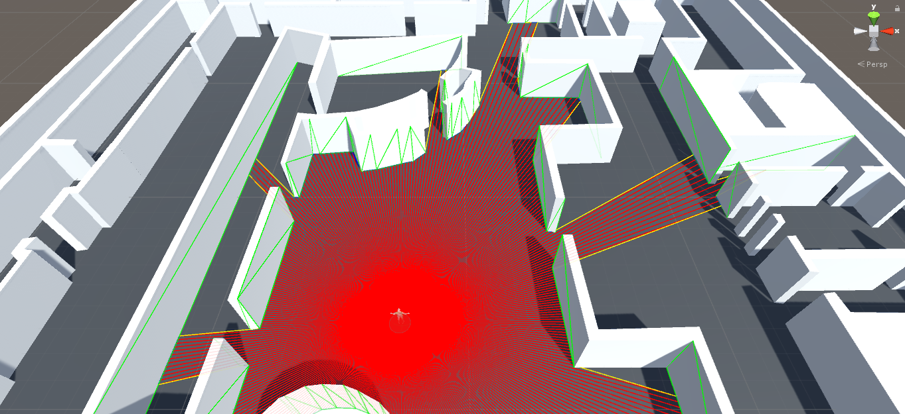
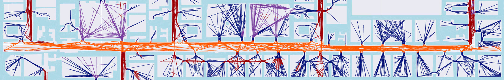

# isovista: Learning Indoor Space Perception
A Framework for Discovering, Learning and Comparing Recurring Structures in Building Floor Plans

> [Jupyter Notebook (Cluster/Train/Predict/Compare)](isovista_cluster_train_predict_compare.ipynb)

## Tensorboard Projector PCA Visualization

[Interactive Tensorboard Projector PCA Visualization](https://projector.tensorflow.org/?config=https://raw.githubusercontent.com/sedand/isovista/master/tf-projector-3426bc5/isovista_projector_config.json)
